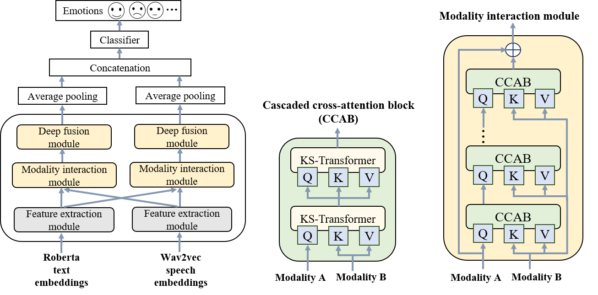

# KS-Transformer

Paper：[Key-Sparse Transformer for Multimodal Speech Emotion Recognition (ICASSP 2022)](https://ieeexplore.ieee.org/abstract/document/9746598)  
This paper was accepted by ICASSP 2022.

## Train on IEMOCAP
### Download datasets
* [IEMOCAP download link](https://sail.usc.edu/iemocap/index.html)  

Note that you should create a metadata file (`.csv` format) to record the `name` and `label` of the samples. Then modify the argument: `meta_csv_file` in `./config/iemocap_feature_config.json` according to the absolute path of the corresponding `.csv` file. The example `.csv` file can be found [here](https://github.com/HappyColor/SpeechFormer/tree/master/metadata#generate-metadata_iemocapcsv-file-for-iemocap).

### Extract wav2vec and RoBERTa feature
* See the functions `extract_wav2vec()` and `extract_roberta()` in file `test_a_sample.py`.
* Each extracted feature is saved in `.mat` format using `scipy`.  

Modify the argument: `matdir` in `./config/iemocap_feature_config.json` to the folder path of your extracted feature.

### Train model
Set the hyper-parameters on `./config/config.py` and `./config/model_config.json`.
Next, run:
```
python train.py
```

## Test one sample
You can use the `test_a_sample.py` file to test a sample.  
You just need to modify these variables in the `test_a_sample.py`:
1. `wav2vec_model_path`: path of the pretrained wav2vec model
2. `roberta_model_path`: path of the pretrained RoBERTa model
3. `ckpt`: your saved checkpoint
4. `wavfile`: path of the audio file (`.wav`) to be detected
5. `txtfile`: path of the text file (`.txt`) to be detected
6. `device`: run on `cpu` or `cuda`

